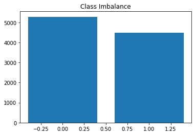
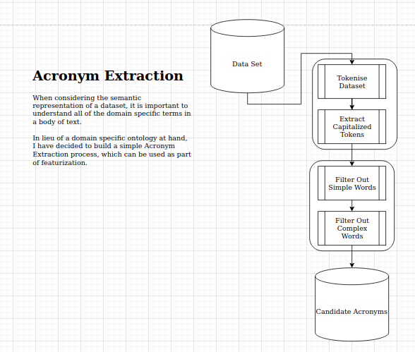
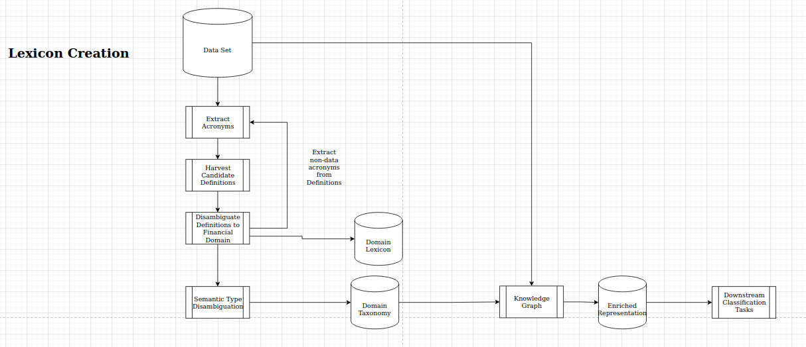

# Regulatory Text Classification

## Challange Points


Ahead of addressing how I approached this challange, and evidence the various answers I give, I will summarise my answers here.

Further to these challange points we have addressed some other forms of exploration in the problem through developing tooling in:
1. Dataset Exploration
2. Automated Taxonomy Generation from the Dataset.

# 1. Why is the model performing worse in a production setting?

This is due to many factors, the main factor is a flawed dataset with a __heavy class bias__. 
This dooms most modelling approaches.

Other issues are:
1. Poor featurization, including non-semantic tokens
2. Small dataset
3. Truncated Data
4. Improved Data hiegiene

# 2. How could we have predicted this?

This could have been easily predicted with more robust testing stratagies including:
1. Test-Train Splits
2. Cross Validation
3. Hold out sets
4. More diverse view of metrics, accuracy is a bias trap.

These would all have given a better picture of the model, however, evaluating on the biased dataset will continue
to have issues with generalisation, and metrics will continue to reflect this bias, and give an overly generous 
view of model performance over unseen data.

## 3. What strategies could we employ to improve the performance? Please consider:
   
In this report we implement several approaches in the [Notebook](challange.ipynb), and futher investigate claims,
such as the imballanced class effect in the [Data Augmentation](notebooks/data_augmentation.ipynb).

The stratagies we adopt are:
1. Augment the dataset with real world, domain specific, examples for negative classes.
2. Implement a robust pre-processing pipeline to improve the semantic content of features.
3. Use hold-out training, and cross validation for performance tracking.
4. Expand the metrics used.

Futher to this, we follow some more radical courses of action:
1. Improve knowledge representatio through automated Knowledge Graph Creation
1. Build Tooling to support Data Exploration.
2. Consider more advanced approaches to vectorisation through dense-vector representations.


## Approach

The Approach taken in this task, followed to the general process:


1. Focus on understanding the data, its characteristics and its limitations
2. Apply some NLP best practices to the provided code to create a more robust approach.
3. Develop Tooling to better understand and enrich the data.
4. Consider more advanced knowledge representations.
5. Explore choice of ML models for the task

## Explore the Data

In order to better understand the task at hand, considerable effort was expended in understanding the data that has been provided, with the understanding that issues in the data, will have a larger effect on model performance, than choice of model or parameters.

To explore the data, I developed a [Web UI](explore.py) which can be accessed with the command `streamlit run explore.py`, and may be available [here](http://74.82.28.180:8501) at times.

### Class Imbalance

Initial inspections show that the data has a significant data imbalance, with a 9:1 ratio of positive examples to negative. This will cause a significant issue in most classification tasks, enabling a 90% success rate of a Dummy model.



The [notebooks/Data Augmentation.ipynb](Data Augmentation Notebook) shows an effective approach to data augmentation, and an in depth evaluation of the augmented dataset. To summarize the approach:

1. Recreate the core result.
2. Demonstrate the weakness of the model.
3. Propose a solution, by balancing the data.
4. Demonstrate a more robust model.

The results can be summarised as:

1. We demonstrate an unbalanced model, evaluates well on unbalanced data with 91% Accuracy.
```
Unbalanced Model on Unbalanced Data
[[  50    0]
 [ 326 3361]]
Accuracy: 0.91
Precision: 1.0
Recall: 0.91
```

2. We demonstrate an unbalanced model, evaluates poorly on balanced data with 46% Accuracy.

```
Unbalanced Model on Balanced Data
[[  50    0]
 [3929 3361]]
Accuracy: 0.46
Precision: 1.0
Recall: 0.46
```

3. We demonstrate an balanced model, evaluates well on balanced data with 95% Accuracy, and a healthy confusion matrix.

```
Balanced Model on Balanced Data
[[3695   53]
 [ 284 3308]]
Accuracy: 0.95
Precision: 0.98
Recall: 0.92
```

Building on these results, we go forward with the augmented dataset.

### Data Truncation

We find that ~3500 documents that are truncated examples of larger documents. This means that most documents are not fully contextualised. 

With a naive truncation approach, cutting off mid word, this could cause issues with non-sensible tokenization for an Token based models, and poorly formed, incomplete sentences which would reduce the effectiveness of dense-vector representations.

This issue would be compounded by the redundant content discussed below, wherein many articles will focus on tables of content, and repeated characters over semantically meaningful content.

This may also create a bias in sparse encodings, with the enriched data being much shorter in length than the core data.

__Actions:__
1. Improve Ingestion to remove semantically redundant information before truncation
2. Truncate along sentence boundries if required.
3. Explore other options to truncation.


### Data Content

We find a mix of well-formatted documents, poorly represented documents, and large sections of redundant data. 

Here we document some examples of poorly ingested data. Unfortunately, these examples all come from the _negative_ class, further hampering class-representation learning. These examples suggest issues with Contents pages, markdown tables, 

```
/ ~- ;,/", #' r~J ,~r r/~~ "''''''0 J~~ tI!// ,
/
~-
;,/",
#'
r~J
,~r
r/~~
"''''''0
J~~
tI!//
,.
```

```
199,560
213,879
230,025
247,578
254,143
–
–
–
–
```

```
Give and Take Forex Bureau Ltd
Glory Forex Bureau Ltd
GNK Forex Bureau Ltd
101.20
101.50
101.50
100.70
```

__Actions:__
1. Improve ingestion around Contents, and Tables.
2. Improve the quality of negative examples. 


### Representation

Here we examine the given approach to feature generation, with an eye to understand the limitations and potential improvements possible when creating a benchmark.

Some identified issues in the current approach, which could be improved include:
1. No stopword removals
2. No numerical removals
3. No punctuation processing

Examining the top words gives the following list, which contains semantically meaningless tokens, which enabling the model to create spurious correlations.

Further to this, limiting the model to 1000 words leaves __328 documents with empty vectors__, providing an impoverished training dataset.

Most common words: 
```
[('the', 230501), ('of', 184134), ('.', 170667), (',', 157027), ('and', 107322), ('to', 102492), (')', 96025), ('(', 91487), ('in', 69894), ('a', 60552), ('or', 45598), ('for', 39553), ('by', 31011), (':', 29829), ('be', 29459)]
```

This creates a feature set, which is equally contaminated with non-semantic features:

```'1': True,
  'S': False,
  '666/2018': False,
  'First': False,
  'published': False,
  'in': True,
  'the': True,
  'Government': True,
  'Gazette': False,
  ',': True,
```

When using a token based approach, we suggest a robust text pre-processing approach:

1. Remove Stop Words
2. Filter Punctuation
3. Collapse related words (lemmatization/stemming)
4. Remove numerical tokens.

We implement several of these approaches in the [Custom PreProcessor](tools.py), and use it in the pipelines models like so:

```
text_clf = Pipeline([
     ('preprocessor', Preprocessor()),
     ('vect', CountVectorizer(stop_words=stopwords)),
     ('tfidf', TfidfTransformer()),
     ('clf', SGDClassifier(loss='hinge', penalty='l2', alpha=1e-3, random_state=42, max_iter=5, tol=None)),
])
```

## Best Practices

### Model Pipelining

Model pipelining allows for robust, well contained models. Here we chose the scikit-learn Pipeline approach, and recreate the original model, as a feature count over the text, fed into a Random Forest Classifier. We keep the core 1000 max words from the original challenge.

Note, that in the original model, features where binary, they have become counts here.

```
clf_unbalanced = Pipeline([
    (
        'vect', CountVectorizer(
            max_features=1000
        )
    ),
    ('clf',  RandomForestClassifier()),
])

```

We futher improve this, with a more robust pipeline with preprocessing and TFIDF encoding and a SGD classifier like so:

```

text_clf = Pipeline([
     ('preprocessor', Preprocessor()),
     ('vect', CountVectorizer(stop_words=stopwords)),
     ('tfidf', TfidfTransformer()),
     ('clf', SGDClassifier(loss='hinge', penalty='l2', alpha=1e-3, random_state=42, max_iter=5, tol=None)),
])
```

### Extended Validation

The original challenge saw validation being performed with the same data as the training, causing validation to be heavily biased, and not reflect performance on unseen data.

The first action was to create an accurate characterization of the accuracy with a hold out set.

While this was mostly addressed by the class imbalance problem, we get the initial characterisation as:

1. False Accuracy __99.97__
2. True Accuracy on hold out data: __96.77__

We can improve out characterisation of the models using cross validation:

```
{'fit_time': array([3.35327482, 6.23692489, 6.20242143, 6.16323233, 6.12892771]),
 'score_time': array([0.8462379 , 0.634341  , 0.61400652, 0.59720397, 0.60720181]),
 'test_precision_macro': array([0.82195424, 0.99578257, 0.99577861, 0.99392523, 0.99531396]),
 'test_recall_macro': array([0.7744665 , 0.995     , 0.995     , 0.99277778, 0.99444444]),
 'test_f1_macro': array([0.75088979, 0.99536979, 0.9953678 , 0.99330667, 0.99485265]),
 'test_accuracy': array([0.75689479, 0.99540347, 0.99540112, 0.99335718, 0.99489014])}
```

## Knowledge Representation

The current approach is to take a text-first vectorisation approach to knowledge representation.
This has been shown to be quite effective for this dataset, however it does have its flaws, 
as it fails to capture meaning in the data, is unable to leverage domain knowledge, and leads to
brittle representations.

There are many ways to address these problems, which have issues of their own, including:
1. Dense vector Embeddings
2. Knowlege Graph Embeddings

Here we look at potential use cases for these approaches, in doing so we utilize both Dense Vector embeddings,
combined with text processing, knowledge base integration and disambiguation, to create a typed taxonomy of
domain specific terms found in the text.

Using this taxonomy, we build an example knowledge graph, which could be used to create knowledge graph embeddings as a rich,
flexible representation.

To create this taxonomy, the following tooling has be developed:
1. Data Exploration
2. Acronym Extraction
3. Taxonomy Creation


# Tools
## Acronym Extraction


## Taxonomy Generation

Lexicon Generation is the process of taking acronyms, resolving them against a knowledge base, disambiguating those candidate concepts to the financial domain, and then assigning a symantic type.

For this we use a comination of
1. Text processing
2. Knowlege base retrieveal (wikipedia)
3. Zero Shot Classification 

The following diagram shows the process taken:



This has been formalised into:
1. [A tool for lexicon creation](create_lexicon.py)
2. [A Process for Taxonomy creation](notebooks/taxonomy_disambiguation.py)


## Data Explorer

The data explorer has been created in 

# Resources

For this demonstration, we lean on some external libraries for the heavy lifting.

1. Sci-kit learn for model training and composition
2. textsearch for keyword search in documents
3. transformers for semantic encoding and disambiguation
4. wikipedia for Acronym resolution
